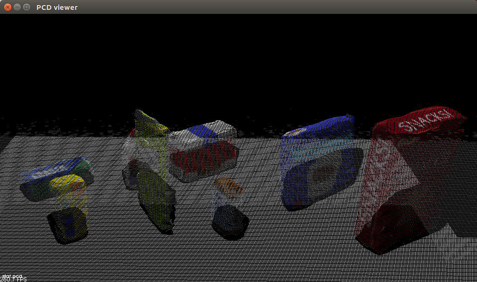
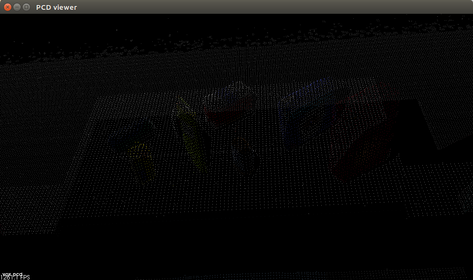
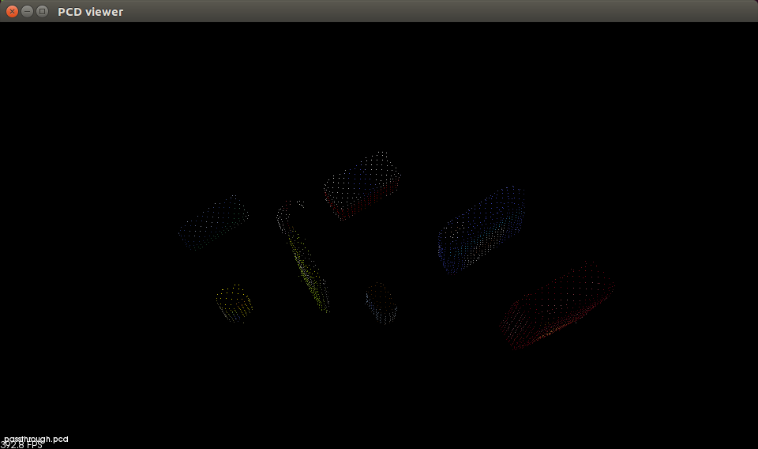
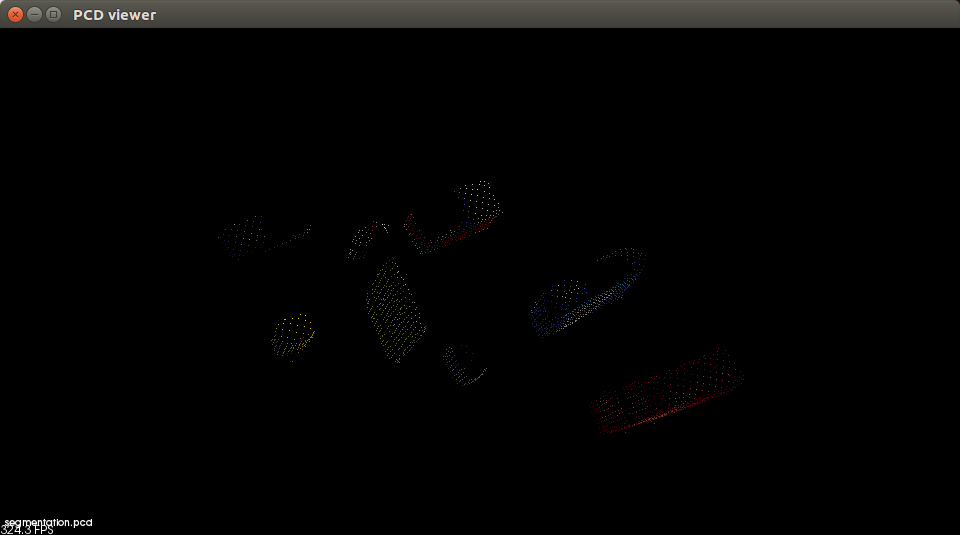
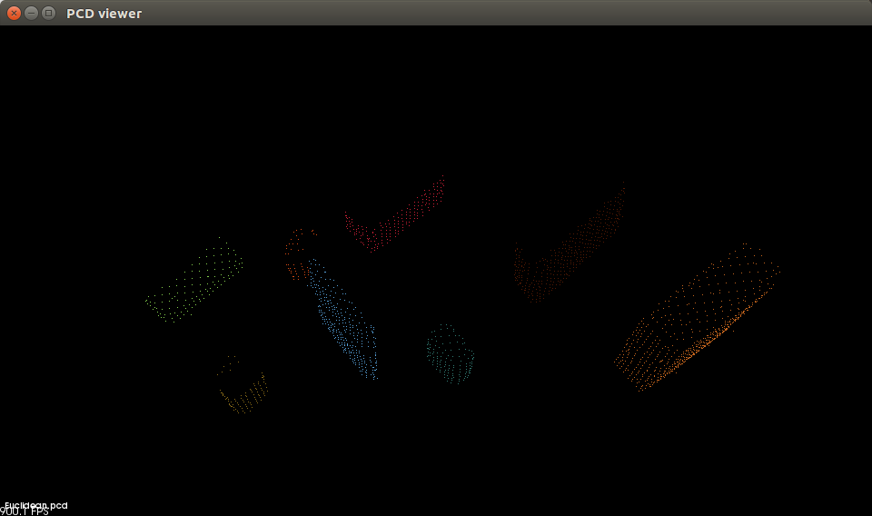
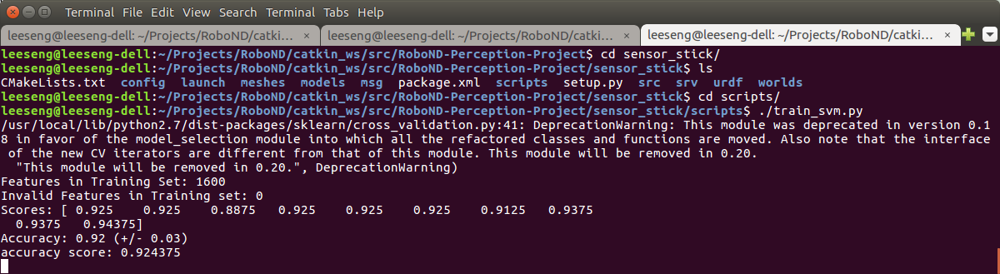
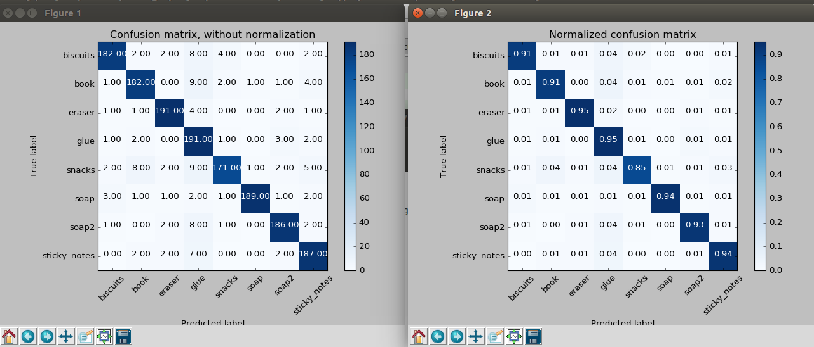
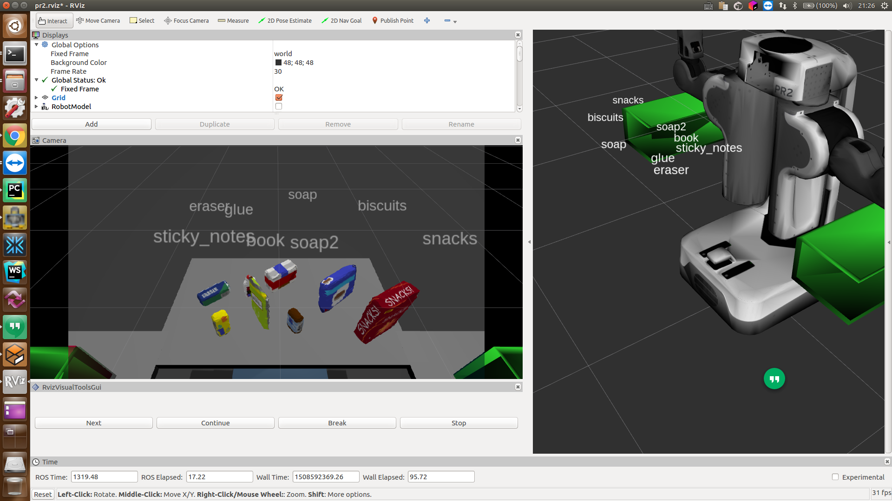

## Project: Perception Pick & Place

---


# Required Steps for a Passing Submission:
1. Extract features and train an SVM model on new objects (see `pick_list_*.yaml` in `/pr2_robot/config/` for the list of models you'll be trying to identify). 
2. Write a ROS node and subscribe to `/pr2/world/points` topic. This topic contains noisy point cloud data that you must work with.
3. Use filtering and RANSAC plane fitting to isolate the objects of interest from the rest of the scene.
4. Apply Euclidean clustering to create separate clusters for individual items.
5. Perform object recognition on these objects and assign them labels (markers in RViz).
6. Calculate the centroid (average in x, y and z) of the set of points belonging to that each object.
7. Create ROS messages containing the details of each object (name, pick_pose, etc.) and write these messages out to `.yaml` files, one for each of the 3 scenarios (`test1-3.world` in `/pr2_robot/worlds/`).  [See the example `output.yaml` for details on what the output should look like.](https://github.com/udacity/RoboND-Perception-Project/blob/master/pr2_robot/config/output.yaml)  
8. Submit a link to your GitHub repo for the project or the Python code for your perception pipeline and your output `.yaml` files (3 `.yaml` files, one for each test world).  You must have correctly identified 100% of objects from `pick_list_1.yaml` for `test1.world`, 80% of items from `pick_list_2.yaml` for `test2.world` and 75% of items from `pick_list_3.yaml` in `test3.world`.
9. Congratulations!  Your Done!

# Extra Challenges: Complete the Pick & Place
7. To create a collision map, publish a point cloud to the `/pr2/3d_map/points` topic and make sure you change the `point_cloud_topic` to `/pr2/3d_map/points` in `sensors.yaml` in the `/pr2_robot/config/` directory. This topic is read by Moveit!, which uses this point cloud input to generate a collision map, allowing the robot to plan its trajectory.  Keep in mind that later when you go to pick up an object, you must first remove it from this point cloud so it is removed from the collision map!
8. Rotate the robot to generate collision map of table sides. This can be accomplished by publishing joint angle value(in radians) to `/pr2/world_joint_controller/command`
9. Rotate the robot back to its original state.
10. Create a ROS Client for the “pick_place_routine” rosservice.  In the required steps above, you already created the messages you need to use this service. Checkout the [PickPlace.srv](https://github.com/udacity/RoboND-Perception-Project/tree/master/pr2_robot/srv) file to find out what arguments you must pass to this service.
11. If everything was done correctly, when you pass the appropriate messages to the `pick_place_routine` service, the selected arm will perform pick and place operation and display trajectory in the RViz window
12. Place all the objects from your pick list in their respective dropoff box and you have completed the challenge!
13. Looking for a bigger challenge?  Load up the `challenge.world` scenario and see if you can get your perception pipeline working there!

## [Rubric](https://review.udacity.com/#!/rubrics/1067/view) Points
### Here I will consider the rubric points individually and describe how I addressed each point in my implementation.  

---
````
### Writeup / README
#### 1. Provide a Writeup / README that includes all the rubric points and how you addressed each one.  You can submit your writeup as markdown or pdf.  
````

### Exercise 1, 2 and 3 pipeline implementation
#### 1. Exercise 1 steps. Pipeline for filtering and RANSAC plane fitting implemented.
We learnt Point Cloud Library APIs to implement filtering and RANSAC plane fitting in the class.

The initial point cloud data is noisy.

TODO: init cloud

First, I apply statistical outlier filter of **20** clusters and stddev_mult is **0.1**. The distance threshold will be equal to: mean + stddev_mult * stddev. Points will be classified as inlier if their average neighbor distance is below mean + stddev_mult * stddev.
```python
    # Statistical Outlier Filtering
    outlier_filter = cloud.make_statistical_outlier_filter()
    outlier_filter.set_mean_k(20)
    x=0.1
    outlier_filter.set_std_dev_mul_thresh(x)
    stat_cloud_filter = outlier_filter.filter()
    pcl.save(stat_cloud_filter, 'stat.pcd')

```



Next, I apply Voxel Grid Downsampling to reduce number of points in Point Cloud. this is to reduce processing power requirement for the pipeline. I applied LEAF_SIZE of **0.01m** which reduces 87% of points, from 426,373 points to 51,836 points. 

```python

    #Voxel Grid Downsampling
    vox = stat_cloud_filter.make_voxel_grid_filter()
    LEAF_SIZE = 0.01
    vox.set_leaf_size(LEAF_SIZE, LEAF_SIZE, LEAF_SIZE)
    cloud_filtered = vox.filter()

    pcl.save(cloud_filtered, 'vox.pcd')
```



In Passthrough filter stage, I enable the point cloud data to be retained in the range of  **0.63** and **1** for in **Z axis** and **0.35** and **1** for **X** axis filtering. This removes table and dropbox point cloud data in the scene.

```python
    #PassThrough Filter
    passthrough = cloud_filtered.make_passthrough_filter()
    filter_axis = 'z'
    passthrough.set_filter_field_name(filter_axis)
    axis_min = 0.63
    axis_max = 1
    passthrough.set_filter_limits(axis_min, axis_max)
    passthrough = passthrough.filter()

    passthrough = passthrough.make_passthrough_filter()
    filter_axis = 'x'
    passthrough.set_filter_field_name(filter_axis)
    x_axis_min = 0.35
    x_axis_max = 1
    passthrough.set_filter_limits(x_axis_min, x_axis_max)
    cloud_filtered = passthrough.filter()

    pcl.save(cloud_filtered, 'passthrough.pcd')
```



For RANSAC plane segmentation, the distance threshold was to set to **0.01m** of method type **pcl.SAC_RANSAC**
```python
    #RANSAC Plane Segmentation
    seg = cloud_filtered.make_segmenter()
    seg.set_model_type(pcl.SACMODEL_PLANE)
    seg.set_method_type(pcl.SAC_RANSAC)
    max_distance = 0.01
    seg.set_distance_threshold(max_distance)
    inliers, coeffcients = seg.segment()

    # TODO: Extract inliers and outliers
    cloud_objects = cloud_filtered.extract(inliers, negative = True)
    cloud_background = cloud_filtered.extract(inliers, negative = False)

    pcl.save(cloud_objects, 'segmentation.pcd')

```



#### 2. Exercise 2 steps: Pipeline including clustering for segmentation implemented.  
I apply Euclidean Clustering to segmentate objects out in point cloud. We need to apply trial and error to find out the parameters as object points count are heavily depends on previous stages especially Voxel Grid Downsampling stage.
If ClusterTolerance is too large, it removes small objects, but if ClusterTolerance is too small, it creates more objects for detection. I set MaxClusterSize to 800 which doesn't remove big object like snack, but if i set to 500, snack object will be break down to 2 smaller objects.  
Eventually, I set **0.03** as ClusterTolerance, MinClusterSize at **30**, and MaxClusterSize at **800**. 

```python
    #Euclidean Clustering
    white_cloud = XYZRGB_to_XYZ(cloud_objects)
    tree = white_cloud.make_kdtree()

    ec = white_cloud.make_EuclideanClusterExtraction()
    ec.set_ClusterTolerance(0.03) # 0.03
    ec.set_MinClusterSize(30)   # 30
    ec.set_MaxClusterSize(800) #800
    ec.set_SearchMethod(tree)
    cluster_indices = ec.Extract()

    #Create Cluster-Mask Point Cloud to visualize each cluster separately
    cluster_color = get_color_list(len(cluster_indices))
    color_cluster_point_list = []

    for j, indices in enumerate(cluster_indices):
        for i, indice in enumerate(indices):
            color_cluster_point_list.append([white_cloud[indice][0],
                                             white_cloud[indice][1],
                                             white_cloud[indice][2],
                                             rgb_to_float(cluster_color[j])])

    cluster_cloud = pcl.PointCloud_PointXYZRGB()
    cluster_cloud.from_list(color_cluster_point_list)

    pcl.save(cluster_cloud, 'Euclidean.pcd')

```



#### 3. Exercise 3 Steps.  Features extracted and SVM trained.  Object recognition implemented.
I capture data features on sensor_stick runtime. To push the object recognition accuracy to above 90%, I setup object capturing process to capture 200 data for each object.
The features are captured in **HSV** color space, histogram bins in **128** and point normals.
```python
models = ['biscuits', 'soap','soap2','book','glue','sticky_notes', 'snacks','eraser']


    # Disable gravity and delete the ground plane
    initial_setup()
    labeled_features = []

    for model_name in models:
        spawn_model(model_name)

        for i in range(200):
            # make five attempts to get a valid a point cloud then give up
            sample_was_good = False
            try_count = 0
            while not sample_was_good and try_count < 5:
                sample_cloud = capture_sample()
                sample_cloud_arr = ros_to_pcl(sample_cloud).to_array()

                # Check for invalid clouds.
                if sample_cloud_arr.shape[0] == 0:
                    print('Invalid cloud detected')
                    try_count += 1
                else:
                    sample_was_good = True

            # Extract histogram features
            chists = compute_color_histograms(sample_cloud, using_hsv=True)
            normals = get_normals(sample_cloud)
            nhists = compute_normal_histograms(normals)
            feature = np.concatenate((chists, nhists))
            labeled_features.append([feature, model_name])

        delete_model()


    pickle.dump(labeled_features, open('training_set.sav', 'wb'))
```

For SVN training, linear SVC kernel is much faster and perform better than polynomial kernel. I changed cross validation fold to **10** as I have more data captured.
```python
# Load training data from disk
training_set = pickle.load(open('training_set.sav', 'rb'))

# Format the features and labels for use with scikit learn
feature_list = []
label_list = []

for item in training_set:
    if np.isnan(item[0]).sum() < 1:
        feature_list.append(item[0])
        label_list.append(item[1])

print('Features in Training Set: {}'.format(len(training_set)))
print('Invalid Features in Training set: {}'.format(len(training_set)-len(feature_list)))

X = np.array(feature_list)
# Fit a per-column scaler
X_scaler = StandardScaler().fit(X)
# Apply the scaler to X
X_train = X_scaler.transform(X)
y_train = np.array(label_list)

# Convert label strings to numerical encoding
encoder = LabelEncoder()
y_train = encoder.fit_transform(y_train)

# Create classifier
clf = svm.SVC(kernel='linear')

# Set up 5-fold cross-validation
kf = cross_validation.KFold(len(X_train),
                            n_folds=10,
                            shuffle=True,
                            random_state=1)

# Perform cross-validation
scores = cross_validation.cross_val_score(cv=kf,
                                         estimator=clf,
                                         X=X_train, 
                                         y=y_train,
                                         scoring='accuracy'
                                        )
print('Scores: ' + str(scores))
print('Accuracy: %0.2f (+/- %0.2f)' % (scores.mean(), 2*scores.std()))

# Gather predictions
predictions = cross_validation.cross_val_predict(cv=kf,
                                          estimator=clf,
                                          X=X_train, 
                                          y=y_train
                                         )

accuracy_score = metrics.accuracy_score(y_train, predictions)
print('accuracy score: '+str(accuracy_score))
```

The accuracy score increase from 85% for 50 data per object, to 92% for 200 data per object. This enable world 3 object detection to constantly exceed 75%.


To utilize trained SVM model, we have to load SVN model from pickle file.
```python
    # Load Model From disk
    model = pickle.load(open('model-200.sav', 'rb'))
    clf = model['classifier']
    encoder = LabelEncoder()
    encoder.classes_ = model['classes']
    scaler = model['scaler']
```

During Object Detection, same feature extraction procedures are required to match as per during SVM model training. 
```python

    for index, pts_list in enumerate(cluster_indices):
        # Grab the points for the cluster
        pcl_cluster = cloud_objects.extract(pts_list)
        ros_cluster = pcl_to_ros(pcl_cluster)

        # Compute the associated feature vector
        christ = compute_color_histograms(ros_cluster, using_hsv=True) #bins of 128
        normals = get_normals(ros_cluster)
        nhists=compute_normal_histograms(normals) # bins of 128
        feature = np.concatenate((christ,nhists))

        # Make the prediction
        prediction = clf.predict(scaler.transform(feature.reshape(1,-1)))
        label = encoder.inverse_transform(prediction)[0]
        detected_objects_labels.append(label)

        # Publish a label into RViz
        label_pos = list(white_cloud[pts_list[0]])
        label_pos[2]+=.4
        object_markers_pub.publish(make_label(label, label_pos, index))

        # Add the detected object to the list of detected objects.
        do = DetectedObject()
        do.label = label
        do.cloud = ros_cluster
        detected_objects_list.append(do)
```




### Pick and Place Setup

#### 1. For all three tabletop setups (`test*.world`), perform object recognition, then read in respective pick list (`pick_list_*.yaml`). Next construct the messages that would comprise a valid `PickPlace` request output them to `.yaml` format.

Below are the results of 3 world.


And here's another image! 


Spend some time at the end to discuss your code, what techniques you used, what worked and why, where the implementation might fail and how you might improve it if you were going to pursue this project further.  


